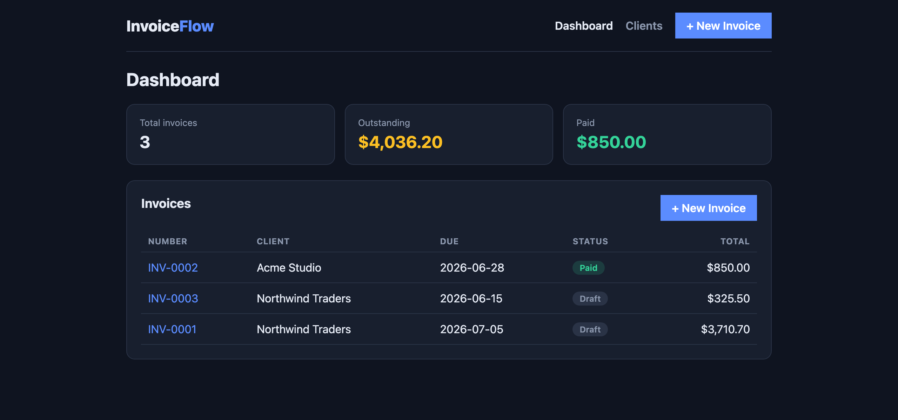

# InvoiceFlow

A full-stack invoicing app: create clients, build invoices with line items and tax, track payment status, and export clean PDF invoices. Built with **React + TypeScript** on the front end and **Node + Express + TypeScript + SQLite** on the back end.

> Portfolio project demonstrating end-to-end full-stack development: typed REST API, relational data with transactions, a polished responsive UI, and a print/PDF-ready invoice document.

[](https://invoiceflow-vbdk.onrender.com/)
&nbsp;


**▶️ Live demo:** https://invoiceflow-vbdk.onrender.com/
<sub>(hosted on Render's free tier — the first load may take ~30s while the service wakes up)</sub>



## Features

- **Client management** — add, list, and remove clients
- **Invoice builder** — multiple line items, quantity × unit price, configurable tax rate, live totals
- **Auto-numbered invoices** (`INV-0001`, `INV-0002`, …)
- **Status tracking** — draft → sent → paid, with a dashboard of outstanding vs. paid totals
- **PDF export** — print-optimized invoice sheet (browser "Save as PDF")
- **Typed end to end** — shared TypeScript types between API and client
- **Zero-config database** — SQLite file, no external services to set up

## Tech stack

| Layer    | Tech                                                |
| -------- | --------------------------------------------------- |
| Frontend | React 18, TypeScript, Vite, React Router            |
| Backend  | Node, Express, TypeScript, better-sqlite3           |
| Database | SQLite (WAL mode, foreign keys, transactions)       |

## Getting started

You need [Node.js](https://nodejs.org) 18+ installed.

### 1. Start the backend

```bash
cd server
npm install
npm run dev          # API on http://localhost:4000
```

### 2. Start the frontend (in a second terminal)

```bash
cd client
npm install
npm run dev          # UI on http://localhost:5173
```

Open **http://localhost:5173**. The Vite dev server proxies `/api` calls to the backend automatically.

### Quick demo flow

1. Go to **Clients** → add a client.
2. Click **+ New Invoice** → pick the client, add line items, set a tax rate.
3. On the invoice page, click **Mark as paid** or **Download PDF / Print**.

## API reference

| Method   | Endpoint                    | Description                       |
| -------- | --------------------------- | --------------------------------- |
| `GET`    | `/api/health`               | Health check                      |
| `GET`    | `/api/clients`              | List clients                      |
| `POST`   | `/api/clients`              | Create a client                   |
| `DELETE` | `/api/clients/:id`          | Delete a client                   |
| `GET`    | `/api/invoices`             | List invoices (with totals)       |
| `GET`    | `/api/invoices/:id`         | Get one invoice                   |
| `POST`   | `/api/invoices`             | Create an invoice with line items |
| `PATCH`  | `/api/invoices/:id/status`  | Update status (draft/sent/paid)   |
| `DELETE` | `/api/invoices/:id`         | Delete an invoice                 |

## Deploying (free tiers)

- **Frontend** → [Vercel](https://vercel.com) or [Netlify]. Build command `npm run build`, output `dist`.
- **Backend** → [Render](https://render.com) or [Railway](https://railway.app). Build `npm run build`, start `npm start`. Set the frontend's API base URL to the deployed backend, or serve both behind one domain.
- For a single-service deploy, host the built `client/dist` as static files from Express.

## Project structure

```
invoiceflow/
├── server/                # Express + TypeScript API
│   └── src/
│       ├── index.ts       # app entry / routes mounted
│       ├── db.ts          # SQLite schema & connection
│       └── routes/        # clients.ts, invoices.ts
└── client/                # React + TypeScript (Vite)
    └── src/
        ├── api.ts         # typed API client + shared types
        ├── pages/         # Dashboard, Clients, NewInvoice, InvoiceDetail
        └── styles.css
```

## License

MIT — free to use as a template for your own projects and client work.
